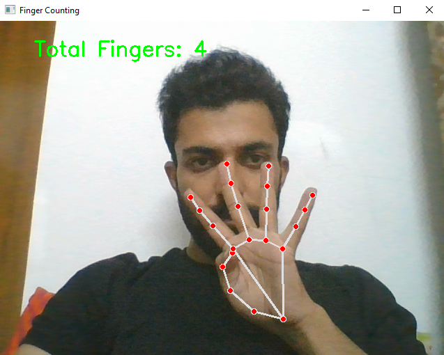

# Real-time Hand Gesture Finger Counting System 
## **Project Overview**

The Real-time Hand Gesture Finger Counting System is an advanced computer vision application that utilizes MediaPipe's hand tracking technology to detect and count the number of fingers raised in real-time. This system provides accurate finger counting for both single and multiple hands, making it suitable for educational purposes, sign language recognition, and interactive applications.
## **outputs**



## **Features**

### **Core Functionality**
- **Real-time Hand Detection**: Advanced MediaPipe hand tracking with 21 hand landmarks
- **Multi-hand Support**: Simultaneous detection and counting for both hands
- **Finger State Recognition**: Accurate detection of finger up/down positions
- **Live Finger Count Display**: Real-time visual feedback of total fingers counted
- **High Accuracy**: Optimized detection confidence levels for reliable performance

### **Hand Tracking Capabilities**
- **Thumb Detection**: Specialized algorithm for thumb position recognition
- **Index Finger**: Precise tracking of index finger state
- **Middle Finger**: Real-time middle finger position detection
- **Ring Finger**: Accurate ring finger state recognition
- **Pinky Finger**: Small finger detection and tracking

### **Technical Features**
- **Optimized Performance**: Configurable detection and tracking confidence
- **Landmark Visualization**: Visual representation of hand structure
- **Real-time Processing**: Smooth video processing at high frame rates
- **Cross-platform**: Compatible with Windows, macOS, and Linux

## **Technology Stack**

### **Core Libraries**
- **OpenCV (cv2)**: Computer vision and video processing
- **MediaPipe**: Google's machine learning framework for hand detection
- **NumPy**: Numerical computing (implicit dependency)

### **System Requirements**
- **Python**: 3.7 or higher
- **Webcam**: USB or built-in camera
- **Operating System**: Windows, macOS, or Linux
- **Memory**: Minimum 2GB RAM recommended
- **Processor**: Multi-core processor for optimal performance

## **Installation**

### **Prerequisites**
Ensure you have Python 3.7+ installed on your system.

### **Step 1: Clone the Repository**
```bash
git clone https://github.com/AbubakarZubair/real-time-finger-counting-system.git
cd real-time-finger-counting-system
```

### **Step 2: Install Dependencies**
```bash
pip install -r requirements.txt
```

### **Step 3: Manual Installation (if requirements.txt is not available)**
```bash
pip install opencv-python
pip install mediapipe
```

## **Usage**

### **Running the Application**
```bash
finger_count.py
```

### **How to Use**
1. **Launch the application** - Run the Python script
2. **Position your hand(s)** - Place your hand(s) in front of the webcam
3. **Raise fingers** - Extend fingers you want to count
4. **View real-time count** - The system displays the total number of fingers detected
5. **Exit** - Press 'q' to quit the application

### **Gesture Examples**
- **Peace Sign**: Shows "Total Fingers: 2"
- **Open Palm**: Shows "Total Fingers: 5"
- **Fist**: Shows "Total Fingers: 0"
- **Thumbs Up**: Shows "Total Fingers: 1"
- **Rock Sign**: Shows "Total Fingers: 2"

## **Technical Architecture**

### **Core Components**

#### **1. Hand Detection Module**
```python
# MediaPipe Hands Configuration
hands = mp_hands.Hands(
    min_detection_confidence=0.7,
    min_tracking_confidence=0.7
)
```

#### **2. Finger Counting Algorithm**
```python
def count_fingers(hand_landmarks):
    # Finger tip landmarks
    finger_tips = [8, 12, 16, 20]  # Index, Middle, Ring, Pinky
    finger_bases = [6, 10, 14, 18]  # Base points for comparison
    
    # Thumb special case (horizontal movement)
    # Other fingers (vertical movement)
```

#### **3. Landmark Detection System**
- **21 Hand Landmarks**: Complete hand structure mapping
- **Coordinate System**: Normalized (0-1) coordinate space
- **Real-time Processing**: Optimized for live video streams

## **Hand Landmarks Reference**

### **MediaPipe Hand Landmarks**
| Landmark ID | Description | Usage |
|-------------|-------------|--------|
| 0 | Wrist | Reference point |
| 1-4 | Thumb | Tip: 4, Base: 2 |
| 5-8 | Index Finger | Tip: 8, Base: 6 |
| 9-12 | Middle Finger | Tip: 12, Base: 10 |
| 13-16 | Ring Finger | Tip: 16, Base: 14 |
| 17-20 | Pinky | Tip: 20, Base: 18 |

### **Finger Detection Logic**
```python
# Thumb Detection (Horizontal)
if landmarks[4].x < landmarks[3].x:
    thumb_up = True

# Other Fingers (Vertical)
if landmarks[tip].y < landmarks[base].y:
    finger_up = True
```

## **Configuration**

### **Adjustable Parameters**
```python
# Detection Confidence
min_detection_confidence = 0.7  # Range: 0.0 to 1.0

# Tracking Confidence
min_tracking_confidence = 0.7   # Range: 0.0 to 1.0

# Display Settings
font_scale = 1                  # Text size
text_color = (0, 255, 0)       # Green color (BGR)
text_thickness = 2              # Text thickness
```

### **Performance Optimization**
- **Lower Confidence**: Faster detection, less accuracy
- **Higher Confidence**: Slower detection, more accuracy
- **Camera Resolution**: Adjust for performance vs quality

## **Advanced Features**

### **Multi-hand Support**
- **Simultaneous Detection**: Count fingers from both hands
- **Total Finger Count**: Combined count from all detected hands
- **Individual Hand Tracking**: Separate processing for each hand

### **Gesture Recognition Potential**
- **Number Recognition**: Count-based gesture identification
- **Sign Language**: Foundation for ASL number recognition
- **Interactive Control**: Use finger count for application control

## **Troubleshooting**

### **Common Issues**

#### **Camera Not Working**
- Check camera permissions
- Ensure no other applications are using the camera
- Try different camera index: `cv2.VideoCapture(1)`

#### **Poor Detection Accuracy**
- **Lighting**: Ensure good, even lighting
- **Background**: Use contrasting background
- **Hand Position**: Keep hands within camera frame
- **Distance**: Maintain 1-2 feet from camera

#### **Finger Counting Errors**
- **Thumb Issues**: Ensure thumb is clearly visible
- **Finger Overlap**: Keep fingers separated
- **Hand Angle**: Face palm towards camera
- **Confidence Levels**: Adjust detection parameters

#### **Performance Issues**
- **Lower Resolution**: Reduce camera resolution
- **Close Applications**: Free up system resources
- **Adjust Confidence**: Lower confidence values for speed

## **Code Structure**

### **Main Components**
```python
# 1. Initialization
mp_hands = mp.solutions.hands
hands = mp_hands.Hands(...)

# 2. Finger Counting Function
def count_fingers(hand_landmarks):
    # Finger detection logic
    
# 3. Main Loop
while cap.isOpened():
    # Frame processing
    # Hand detection
    # Finger counting
    # Display results
```

### **Function Documentation**
- **`count_fingers(hand_landmarks)`**: Counts raised fingers from hand landmarks
- **Main Loop**: Processes video frames and displays results
- **Landmark Processing**: Converts normalized coordinates to screen positions

## **Future Enhancements**

### **Planned Features**
- **Gesture Recognition**: Advanced hand gesture identification
- **Sign Language Support**: ASL number recognition
- **Mobile App**: iOS and Android versions
- **Voice Feedback**: Audio announcement of finger count
- **Game Integration**: Interactive games using finger counting
- **Multiple Languages**: Internationalization support

### **Technical Improvements**
- **GPU Acceleration**: CUDA support for faster processing
- **Model Optimization**: Lightweight models for mobile devices
- **Custom Training**: Train models for specific use cases
- **Cloud Integration**: Remote processing capabilities

## **Educational Applications**

### **Learning Scenarios**
- **Mathematics**: Basic counting and number recognition
- **Sign Language**: ASL number learning
- **Motor Skills**: Hand coordination development
- **Interactive Learning**: Engaging educational content

### **Classroom Integration**
- **Interactive Lessons**: Student participation through gestures
- **Assessment Tools**: Quick counting exercises
- **Accessibility**: Support for hearing-impaired students

## **Acknowledgments**

- **Google MediaPipe Team** - For the excellent hand tracking framework
- **OpenCV Community** - For computer vision tools and documentation
- **Contributors** - All developers who have contributed to this project

## **Contact Information**

- **Project Maintainer**: [Abubakkar Zubair]
- **Email**: [abubakarkhan17110@gmail.com]
- **GitHub**: [(https://github.com/AbuakarZubair)]


